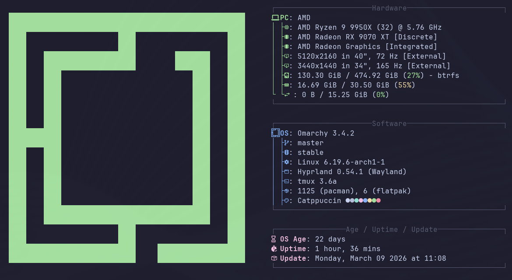

# ~/rallanvila

### High-Velocity Engineering • Unix Philosophy • Keyboard-Centric Workflow

**I use Arch, btw.** (And yes, my `.dotfiles` are better documented than your
company's API.)

---

### $ whoami --verbose

I am a minimalist web architect bridging the gap between "Hacker-Chic"
engineering and enterprise-grade delivery. I believe if you have to do it twice
manually, you script it. If it doesn't have a keyboard shortcut, it doesn't
exist.

- **Keyboard:** Glove 80 (because standard layouts are for the uninitiated).
- **Philosophy:** Unix ("Do one thing and do it well").
- **Workflow:** Local-first, terminal-only, 0% bloat.
- **Current Status:** Architecting scalable new features and engineering
  high-traffic pipelines. Killing technical debt and refactoring placeholder
  sites into 0% bloat, enterprise-grade platforms.

---

### 🛠️ The Tech Stacks

| Specification   | 🚀 `[Aspiring_Neckbeard-Lab]`             | 🏛️ `[enterprise/ops]`           |
| :-------------- | :---------------------------------------- | :------------------------------ |
| **Philosophy**  | _2026 High-Performance Standard_          | _Deep State & Scalable Systems_ |
| **Framework**   | Next.js 16 (App Router) + React 19        | Next.js 14 + React 18           |
| **Logic/State** | TypeScript + **Zustand** + Server Actions | Redux Toolkit + Axios           |
| **Styling**     | Tailwind v4 + Shadcn UI + Framer Motion   | Material UI + AOS               |
| **Icons/UI**    | Lucide + Radix UI                         | Material Icons + i18next        |
| **Reliability** | Strict Typing (0% casting)                | Jest + Playwright + ESLint 9    |
| **Runtime**     | **Node.js (>=20)**                        | **Node.js (>=18)**              |

---

### ⌨️ Base Environment `(Global)`

| Component      | Stack Specification                                                                       |
| :------------- | :---------------------------------------------------------------------------------------- |
| **OS**         | **Arch Linux** (I use it, btw)                                                            |
| **Terminal**   | **Ghostty** + **Tmux** (Multiplexed local-first workflow) + Sesh                          |
| **Shell**      | **Zsh** for quality of life living in my terminal, and **Bash** for heavy-duty automation |
| **Editor**     | **Neovim** (Configured via `Snacks.nvim`)                                                 |
| **RIP**        | `Telescope.nvim` 🪦 _(Snacks.picker is just faster)_                                      |
| **Completion** | **blink.cmp** (Rust-powered speed > nvim-cmp)                                             |
| **Hardware**   | **Glove80** (Ortholinear or bust)                                                         |

---
